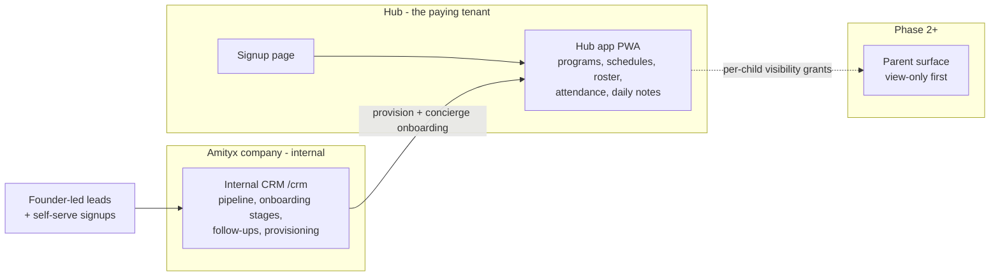
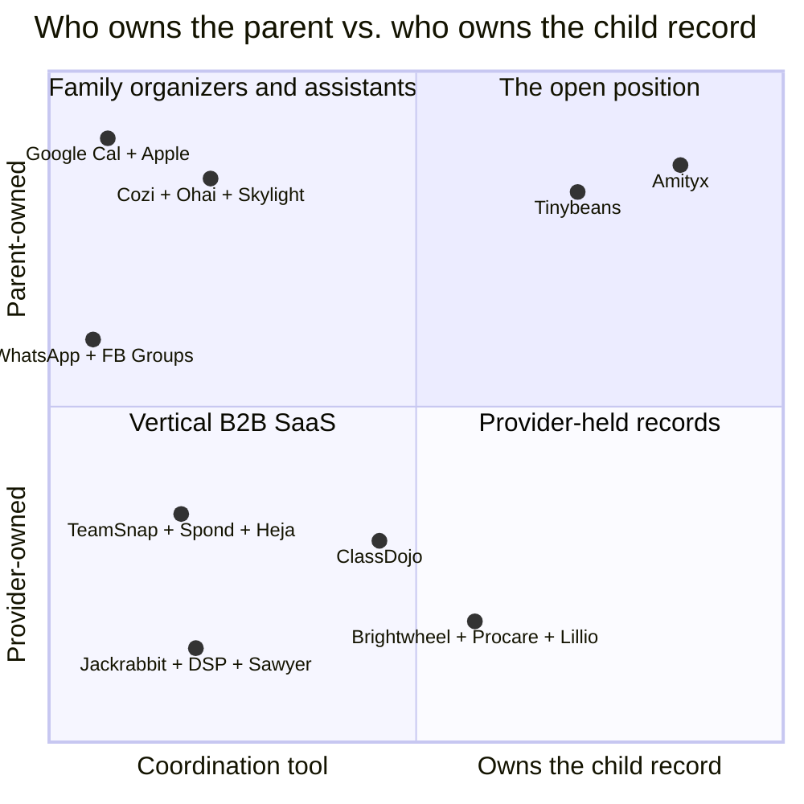
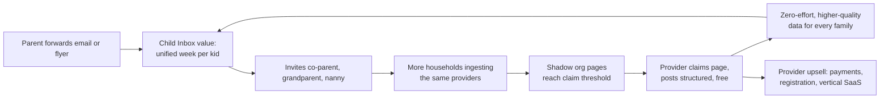
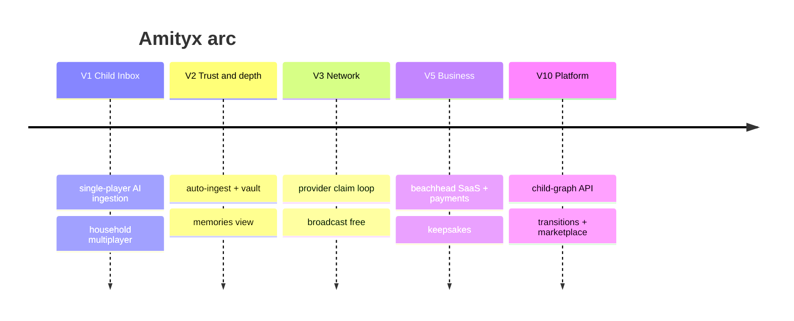
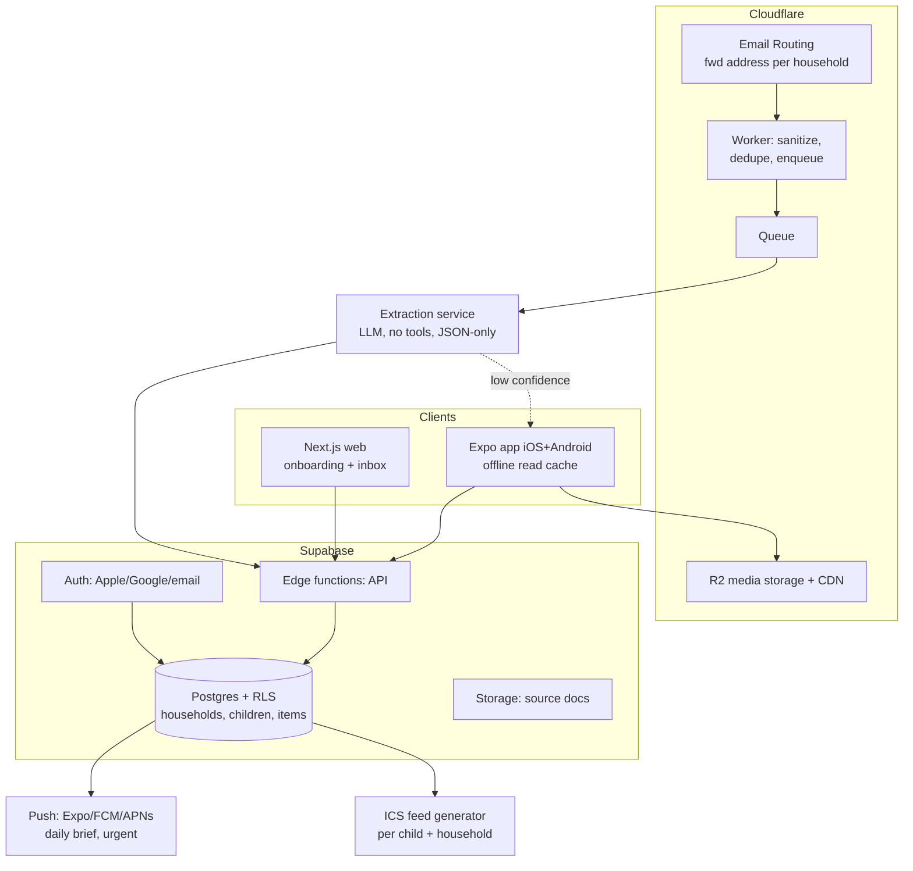
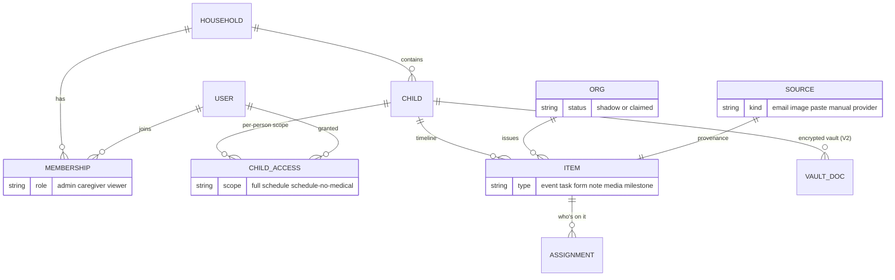

# Amityx — Living Product Specification

**Version 0.2 (provider-first pivot)** · updated 2026-07-11 · Owners: founders · Status: pivot ratified by founder; V1 build pending kickoff
Changelog: v0.1 founding draft (parent-first) → **v0.2 pivot**: provider-pays B2B, AI on hold, web+PWA only, $0 infra. See [Pivot v0.2](#pivot-v02--provider-first-2026-07-11).
Companion research: [`R-001`](../context/research/R-001.md) (parent-side landscape) · [`R-002`](../context/research/R-002.md) (provider-side landscape + alh-tracker pattern study) — **[V]** = web-verified 2026-07-11; **[K]** = model-knowledge, verify before citing externally.

> **One-line thesis (v0.2):** Become the operations platform that toddler activity hubs pay for —
> internal CRM + concierge onboarding, hub app, then a parent surface — and let the paying hub
> network bootstrap the long-term prize v0.1 identified: the **child graph**, one longitudinal
> record per child across every activity. The entry door changed (hubs, not inboxes); the endgame
> did not.

## Table of contents
0. [**Pivot v0.2 — provider-first (2026-07-11)**](#pivot-v02--provider-first-2026-07-11) ← current strategy
1. [Executive summary](#0-executive-summary) (v0.1, partially superseded)
2. [Founder assumption audit](#1-founder-assumption-audit)
3. [The problem](#2-the-problem)
4. [Competitive landscape](#3-competitive-landscape)
5. [Personas](#4-personas)
6. [Strategy: wedge and moat](#5-strategy-the-wedge-and-the-moat)
7. [Product design](#6-product-design)
8. [AI system](#7-ai-system)
9. [Growth and virality](#8-growth-and-virality)
10. [Business model](#9-business-model)
11. [MVP and roadmap](#10-mvp-and-roadmap)
12. [Technical design](#11-technical-design)
13. [UI design](#12-ui-design)
14. [Master critique and next decisions](#13-master-critique-open-questions-next-decisions)

---

## Pivot v0.2 — provider-first (2026-07-11)

### P.1 What the founder decided (and what it means)
1. **The payer is the toddler activity hub owner** — art class, day care, swimming, boot camp,
   karate, multi-activity venues. Parents are no longer the entry customer.
2. **AI/LLM features on hold** (D-004) — no model spend. The Child Inbox wedge (§5) and AI system
   (§7) are parked, not deleted.
3. **Web + mobile via installable PWA, no app stores** (D-005) — one responsive SPA.
4. **$0 infrastructure** on existing accounts (D-006): GitHub `AmityxRepo/amityx`, Vercel
   `amityx`, Supabase `jjnzbayatcfkkoyorhes`, transactional email via Google Workspace
   (help@agapaycare.com SMTP).
5. **Business flow mirrors AgapayCare/alh-tracker** (D-007): the founder's company runs an
   **internal CRM** (pipeline, onboarding stages, follow-ups, provisioning); hub owners use the
   **signup page and the app**. A parent surface follows later, exactly like alh-tracker's
   Phase-2 family portal.

### P.2 The operating model (three surfaces)

Sales motion: founder/staff-led with **concierge onboarding** — we set the hub up ourselves via
the CRM. This is the AgapayCare playbook and it directly attacks the incumbents' biggest switching
wound (iClassPro-class migration fees of $300–800 **[V]**, R-002).

### P.3 ICP and the competitive read (R-002)
**ICP:** owner of a toddler/preschool-age activity hub, especially **multi-activity venues** (one
roof: art + swim + karate + open-play + camps), 1–3 locations, 30–300 enrolled children,
currently on spreadsheets + 2–3 single-purpose tools.

The market splits three ways, and multi-activity toddler hubs fall in the crack:
| Cluster | Players | DNA | Entry price **[V]** |
|---|---|---|---|
| Class-roster SaaS | iClassPro, Jackrabbit, Pike13, Amilia, Enrollsy, Omnify, Sawyer | single-vertical class workflows | $49–139/mo + setup/migration fees |
| Playground/POS | ROLLER, WakeSys, Aluvii, Parker, WellnessLiving | walk-in ticketing, parties, POS | mid-market+ |
| Licensed childcare | brightwheel, Procare, Lillio | compliance-grade daycare | $36–1,800/mo |

**Differentiation (in order of defensibility):** (1) multi-activity toddler operations as the
first-class model — programs of different shapes under one roster/attendance spine; (2) concierge
onboarding + free migration, operated through the internal CRM; (3) modern 375px-first staff PWA
(incumbents are desktop-web-era); (4) $0 cost base → aggressive entry pricing under the $79–139
floor; (5) later, the parent surface incumbents bolt on badly.

### P.4 What's parked vs. what survives from v0.1
| v0.1 element | v0.2 status |
|---|---|
| Child Inbox wedge (§5), AI system (§7) | **Parked.** Revisit trigger: funded LLM key + ≥10 active hubs. Safety rules in §7.2 bind whenever AI returns. |
| Consumer freemium #1 (§9) | **Parked** with the parent surface. Provider SaaS (#2) is now the business; payments (#3) stays the venture case. |
| Expo iOS+Android, app stores | **Dropped** for PWA (D-005). |
| Child-spine schema, RLS, provenance | **Survives** — children stay first-class records (`context/ARCHITECTURE.md`), so the Phase-2+ parent surface and the long-run child graph need no rewrite. |
| Provider claim loop (§8) | **Transformed** — from shadow-page virality to direct sales + CRM pipeline now; claim-loop mechanics become relevant again if/when the parent surface ships. |
| No-ads commitment, privacy posture, export-anything | **Survives unchanged.** |
| Personas | Dee (studio owner) & Tom (camp) are **now V1 primary**; Maya/Jess become end-beneficiaries via their hub; Ms. Park-type staff are daily users. |

### P.5 V1 scope and revised roadmap
**V1 (the active MVP — acceptance criteria live in `context/OBJECTIVE.md`):** hub self-signup →
programs/class schedules (multi-activity templates) → staff PWA roster + check-in/out attendance +
daily notes per child → guardian records → internal CRM (pipeline, onboarding checklist,
follow-ups, provisioning) → adversarial multi-tenant RLS proof → live at $0 on the pinned
accounts. **Excluded from V1:** payment processing (record/track only), AI, parent-facing
anything, store apps, marketplace.

| Version | Theme | Adds |
|---|---|---|
| V1 | Hub ops core + internal CRM | scope above |
| V2 | Money + reach | Stripe payments/registration ($0 fixed cost — fees ride on hub revenue; founder OK required per COST_POLICY), waivers/forms, announcements to guardians (email), CSV import migration kit |
| V3 | Parent surface (read-only PWA) | per-child schedule/notes/photos visibility grants — alh family-portal pattern, counsel-reviewed |
| V4 | Parent surface grows teeth | multi-hub child view — the child graph starts here, through hubs instead of inboxes (v0.1 §5 revived) |
| V5+ | AI returns (trigger-gated) | daily-notes drafting for staff, digests for parents (§7 designs, §7.2 safety rules) |

### P.6 V1 metrics and kill criteria (replace §13.2)
- **Traction:** 5 hubs live with real schedules within 90 days of V1; ≥3 of them with weekly-active
  staff (attendance logged ≥3 days/wk).
- **Willingness to pay:** ≥3 hubs converted to a paid commitment (any nonzero price) by day 120 —
  free pilots don't count as validation past that line.
- **Kill/pivot:** if after 10 concierge-onboarded hubs none will pay, the segment is a hobby
  market for us — re-derive (candidates: move up-market, or revive parent-first with funding).
- **Ops health:** cross-tenant RLS test suite green on every migration; $0 infra bill holds.

### P.7 Co-founder assessment — the honest version
This pivot does the thing v0.1's assumption audit (A3) warned against: **a head-on fight with
entrenched vertical B2B SaaS.** It can still be right, for four reasons: the multi-activity
toddler niche is genuinely unserved (R-002 gap analysis); concierge GTM is a real SMB wedge that
self-serve incumbents structurally under-invest in; the founder already operates this exact
playbook at AgapayCare (pattern reuse de-risks build AND ops); and $0 cost base means survival
doesn't depend on venture pacing. What we gave up: the zero-CAC consumer loop and single-player
adoption speed — **founder sales capacity is now the growth bottleneck**, and that constraint,
not code, will set the V1 timeline. Watch items: Vercel Hobby commercial-use terms and Supabase
free-tier limits (R-002) must be re-checked before the first paying customer; and "toddler" vs
"youth" scoping needs a decision — karate/boot-camp hubs skew older, and restricting to 0–5
shrinks the ICP while 0–12 dilutes the toddler positioning.

**Key insights:** The endgame (child graph) is unchanged; only the entry door moved. The internal
CRM isn't overhead — it IS the differentiator (concierge onboarding as product).
**Risks:** A3 head-on risk absorbed knowingly; sales capacity bottleneck; free-tier terms;
ICP age-band ambiguity.
**Open questions:** First-10-hubs list (does the founder have warm relationships as with ALH?);
age-band scoping (0–5 vs 0–12); entry price point (recommend: free concierge pilot → $49–79/mo,
undercutting the $79–139 floor); does "Amityx" brand serve B2B hub owners? (name test still open).
**Next decisions:** Founder confirms ICP age band + first-10 list → kick off cycle 3 (V1 build:
T-003..T-009 backlog is drafted in `context/tasks/`).

### P.8 Penetration strategy — the ClassDojo question (PROPOSED, 2026-07-11 — pending founder ratification; not yet reflected in OBJECTIVE/tasks)

**The objection this answers:** hub owners won't adopt software that adds process *during* class —
staff hands are full (wet pool decks, paint, ten toddlers). Any strategy that starts with "your
staff will log attendance in our app" loses at hello. Founder proposal: study how ClassDojo
penetrated education.

**What ClassDojo actually did [K]:**
1. Targeted the *practitioner* (teacher), never the institution buyer — no sales force.
2. Free forever for that practitioner; monetized the *parents* years later (Plus, tutoring).
3. Instant single-player value in minutes, aimed at the teacher's OWN daily pain — it removed
   work (parent comms, behavior tracking) rather than adding process.
4. Parents pulled in by the teacher (photos, reports about *their* kid) — emotional gravity.
5. Spread teacher→teacher inside dense buildings (40 teachers per school), then school→school.
6. Product felt delightful and personal, not enterprise.

**What transfers vs. what doesn't (the challenge):**
| Dojo element | Transfers to toddler hubs? |
|---|---|
| Bottom-up, free entry, no forced process | **Yes — adopt.** The free layer must remove work, not add it. |
| Parent emotional pull (photos of MY kid) | **Yes, amplified** — toddler parents are insatiable for photos; brightwheel's daily photo report proved it in daycare **[K]**. |
| Practitioner density drives spread | **No.** A school has 40 teachers in one building; hubs are isolated SMBs. Replace with: parent cross-hub pressure ("karate sends photos — why doesn't ballet?") + owner Facebook groups (where Dee buys software, §4.8). |
| 30 contact-hours/week emotional density | **No.** A hub sees a kid 1hr/week; per-parent engagement is thinner. Free layer must be near-zero marginal effort for the hub. |
| Decade of VC-funded free before monetizing | **No.** We need paid conviction by day ~120 (P.6). Free tier must have ~zero COGS (it does, on our infra — except photo storage, see below) and a short, natural upsell. |
| Monetize parents, never the practitioner | **Partially.** Keep the OWNER as the payer (v0.2 economics); parents stay free. Dojo-style parent subscriptions are a Phase-3+ option, not the plan. |

**One sharpening Dojo doesn't give us:** the owner's #1 pain isn't ops — it's *filling classes*.
Delight (photos) wins parents; **revenue wins owners**. So the free hook should attack both:

**The adapted playbook — "Dojo motion, brightwheel emotion, Sawyer economics":**
- **Free forever layer (the hook), zero during-class process:**
  (a) *public class/booking page* — beautiful listing + booking-request/waitlist capture (fills
  classes = makes the owner money; roster auto-builds from requests, killing setup work);
  (b) *parent broadcast + photo moments* — one optional in-class action (snap a photo, something
  staff already do for Instagram), announcements/reminders otherwise written outside class hours;
  (c) *parent kiosk self check-in* (tablet at the door) — parents do the labor, not staff;
  (d) parents need **no app install**: email/SMS web links (PWA advantage).
- **Paid layer (the business, upsell after habit):** ops suite — scheduling, attendance analytics,
  enrollment/registration forms, CRM-grade reporting, (V2) payments. Sold by in-product moments:
  "23 families viewed this week's photos — let them self-register for fall."
- **"Powered by Amityx" on every parent-facing artifact** — every booking page, photo email, and
  reminder is an ad to parents who know other hub owners (Dojo's silent loop).
- **Concierge onboarding stays** (our CRM engine): we build the hub's page and import their roster
  ourselves — adoption cost ≈ one phone call. This is the anti-iClassPro move (their $300–800
  migration fees, R-002).
- **Photo storage is the honest COGS crack AND the upgrade trigger:** Supabase free tier = 1GB.
  Free tier keeps a rolling 30-day photo window (compressed); the permanent archive/keepsake is
  paid — which converts via the parents' own loss-aversion, pushing the owner to upgrade.

**What ratifying this changes (would become v0.3 + D-008):**
1. V1 scope: ADD free booking page + parent broadcast/photo moments + kiosk check-in; SIMPLIFY
   staff attendance (optional, one-tap, kiosk-first). Parent *view* arrives in V1 as link-based
   read-only — which pulls per-child photo-consent flags and guardian-scoped access forward from
   Phase 3 into V1 (privacy design, counsel check on photo consent language).
2. OBJECTIVE criteria: activation metric shifts from staff attendance-logging to *parents
   connected per hub* + *booking requests per hub*; P.6 willingness-to-pay criterion stays.
3. Tasks: T-007 re-scoped (kiosk + simplified attendance), new T-010 (booking page), T-011
   (broadcast/photos + consent model); T-005 schema adds consent + booking tables.
**Risks of this path (stated while calm):** free-forever is nearly impossible to walk back
(TeamSnap's ad resentment shows the failure mode); paid conversion gets *slower* than
pilot-then-pay — the P.6 day-120 gate must survive ratification, or we drift into Dojo's
decade-long free runway without Dojo's VC; photo features move child-media privacy from Phase 3
to V1 (consent UX + storage security are no longer deferrable); and a booking page without
payments is a lead-capture tool, not registration — set owner expectations honestly.

**Key insights:** The Dojo lesson isn't "free for teachers" — it's *enter through the person whose
problem you remove, and let the child's gravity pull everyone else in*. For hubs, the removable
problem is empty classes and parent-comms drudgery, not attendance.
**Risks:** monetization delay; early privacy surface; free-tier storage COGS.
**Open questions:** free-tier photo window (30 vs 90 days); kiosk hardware assumption (hub's own
tablet?); does the booking page launch before or with the parent broadcast?
**Next decisions:** Founder ratifies/amends P.8 → spec bumps to v0.3, D-008 logged, OBJECTIVE +
T-005/T-007 re-scoped, T-010/T-011 drafted — then cycle-3 build starts from the amended backlog.

---

## 0. Executive summary

> **v0.2 note:** this section summarizes the v0.1 parent-first strategy. The strategy pivoted —
> see [Pivot v0.2](#pivot-v02--provider-first-2026-07-11). Preserved as the design rationale for
> the Phase-3+ parent surface and the child-graph endgame.

**The problem is real and severe.** A family with two kids in school plus activities receives
child-logistics information through 6–10 channels (provider apps, email, group texts, Facebook,
paper). One parent — usually one specific parent — is the human integration layer. The cost is
missed events, duplicated data entry, household conflict, and a permanent low-grade anxiety the
market now calls "the mental load." **[V]** — the 2026 wave of AI family assistants (Ohai, Milo,
Skylight) all sell against exactly this pain, which validates it and crowds it.

**The founder's framing needs one correction.** "The single app parents open every day" is the
*outcome*, not the strategy. Every super-app-for-families attempt died by building 30 shallow
features before earning one daily habit. The strategy that survives contact with this market:

1. **Wedge (V1):** single-player AI ingestion — *"Forward anything; we turn it into your kid's
   week."* No provider adoption required. Works on day one for daycare, ballet, soccer, church —
   because it ingests their output instead of asking them to switch.
2. **Structural multiplayer (V1):** every household has ≥2 caregivers; the second caregiver invite
   is the product working, not a growth hack.
3. **Moat (V2–V5):** the child-centric data model turns plans into a longitudinal record —
   development, milestones, memories — which is emotionally expensive to abandon. Then the
   **provider claim loop** (shadow org pages built from ingested email, claimable free by the
   coach/studio) converts parent-side demand into a two-sided network without a sales force.
4. **Venture scale (V5+):** payments and provider SaaS in one beachhead vertical, then the child
   graph as a platform.

**Venture-scale verdict: yes, conditionally.** Consumer subscription alone caps out (~$50–150M ARR
ceiling — the Cozi trap). The venture case requires reaching the payments layer (US families spend
~$30–40B/yr on youth sports alone **[K]**, plus ~$60B on childcare **[K]**; incumbents monetize
2.5–4% of tuition/fees flow) and/or provider SaaS. The spec is sequenced so the consumer product is
the customer-acquisition engine for those layers, not the whole business.

**The uncomfortable truth to hold onto:** the ingestion wedge is contested *now* (Ohai launched by
the Care.com founder; Skylight ships an SMS assistant **[V]**). The window for the child-graph
differentiation is open because all of them anchor on the household to-do frame — but it will not
stay open for years. Speed to a sharp V1 matters more than completeness.

---

## 1. Founder assumption audit

You asked to be challenged. These are the places the brief, as written, would sink the company.

| # | Assumption in the brief | Verdict | Correction |
|---|---|---|---|
| A1 | "The single app parents open every day" | **Trap as a starting point** | Daily-open is earned by one habit loop (the daily brief), not by feature count. Build the loop, not the surface area. |
| A2 | "Works for daycare AND ballet AND swim AND church AND…" (14 verticals) | **Right on the parent side, fatal on the provider side** | Horizontal is only possible where adoption is single-player (parents). Providers buy vertical software with vertical workflows (recitals ≠ rosters ≠ nap logs). Serve all verticals by *ingesting* them; sell software to only ONE vertical, later. |
| A3 | (implied) "Replace Brightwheel/TeamSnap/Jackrabbit" | **Wrong geometry** | You cannot out-feature 14 entrenched B2B players simultaneously. Be the layer above: coexist, ingest, then selectively replace where incumbents are weakest (SMB activity providers, V5). |
| A4 | The PRODUCT section's ~30 features | **Overbuild risk** | The list is a 5-year map, not a product. MVP ships 6 of them (§10). Everything else is sequenced or cut. |
| A5 | (implied) Parents will pay for organization | **Weak evidence** | Organizer willingness-to-pay is ~$30–120/yr and only post-habit (Ohai $9.99/mo is the current ceiling test **[V]**). Payment volume and provider SaaS are where venture revenue lives; consumer Plus is margin, not the model. |
| A6 | "AI-first" as the differentiator | **AI is the enabler, not the moat** | Extraction is replicable in a quarter by anyone (and Gmail/Apple already auto-extract events). Moat = child graph + household multiplayer + provider network + trust posture. |
| A7 | Competitor list = daycare apps + sports apps + calendars | **Misses the actual fight** | The 2024–26 AI family-assistant wave (Ohai, Milo, Skylight Assistant, Hearth, Maple, Carly **[V]**) is the direct competition for the wedge. §3 covers them. |
| A8 | (implied) Memories/development are features for later | **Half wrong** | They're not V1 *features*, but the child-centric data model that makes them possible must be in the V1 schema — retrofitting task-centric data into a child graph is a rewrite. |

Also flagged, smaller: **the name.** "Amityx" scores poorly on the say-it-to-another-parent-at-
pickup test (spelling ambiguity, pharma/-x connotation, Amityville adjacency). Not urgent; test
before spending brand dollars. (Open question §13.)

**Key insights:** The vision is right; the sequencing in the brief is the risk. Horizontal-parent /
vertical-provider is the only geometry that avoids fighting everyone at once.
**Risks:** Founder conviction in "everything app" produces a 14-month build with no habit loop.
**Open questions:** Which single provider vertical do we eventually sell into first? (Recommended:
youth activity SMBs — §5.) Name test.
**Next decisions:** Ratify A1–A8 corrections before any code; they are what the MVP is derived from.

---

## 2. The problem

### 2.1 Problem inventory, ranked by severity
Severity = frequency × emotional/financial cost × current-solution badness. Evidence class in brackets.

| Rank | Problem | Who feels it | Today's "solution" | Severity |
|---|---|---|---|---|
| P1 | **Fragmented inbound** — each org has its own channel (app, email, text chain, FB group, paper flyer). Info arrives unstructured, on the org's schedule, per-org, not per-child. | All parents; peaks with 2+ kids | The parent's brain + Sunday-night email archaeology | **Critical** — the missed-cleats / wrong-pickup-time / forgotten-spirit-day loop fires weekly |
| P2 | **The mental load is single-threaded** — one caregiver becomes the household's scheduler/integrator; the system fails when they're sick, traveling, or divorced. | Default parent (statistically, mothers); acute in divorced households | Shared Google Cal that only one person writes to | **Critical** — cited as top marital-conflict driver in mental-load discourse **[K]**; "30+ hrs/wk coordinating" claim in market copy **[V]** |
| P3 | **Multi-caregiver information asymmetry** — co-parent, ex-spouse, grandparent, nanny each get partial, stale copies. | Divorced/blended families worst; dual-income always | Forwarded screenshots; verbal handoffs | **High** — in divorce contexts it becomes legal-grade conflict (OurFamilyWizard exists because of it **[K]**) |
| P4 | **Re-entering the same data forever** — emergency contacts, allergies, insurance, pickup lists, waivers: re-typed 8–15×/year into different systems. | All parents | Muscle memory and rage | **High** — pure deadweight; no one defends the status quo |
| P5 | **The record evaporates** — photos, daily reports, milestones, report cards live in provider systems and are lost at churn (age-out, school change). Nothing longitudinal is parent-owned. | All parents, felt at transitions | Camera roll chaos; Brightwheel export-if-you-remember | **High but silent** — low urgency day-to-day, severe regret later; this is the emotional-moat problem |
| P6 | **Development opacity** — "is my kid on track?" across speech, motor, swim level, reading level, belt rank — scattered or absent. | 0–5 parents (milestones), 6–12 (skills) | Pediatrician once a year; vibes | **Medium-high** — high anxiety, low tooling |
| P7 | **Payments/admin sprawl** — tuition here, league fees there, recital costumes by Venmo. | All; providers feel it worse | 6 payment systems | **Medium** — annoying, but each system individually works |
| P8 | **Discovery** — finding the right camp/class; registration sniping (camps fill in minutes). | Seasonal, urban acute | FB groups, word of mouth, spreadsheets | **Medium** — real, monetizable, but not a daily pain |

### 2.2 Why the gaps persist (this is the part that matters)
1. **The payer isn't the sufferer.** Provider software is bought by providers; the parent
   experience is a checkbox in a B2B deal. Nobody in the value chain is paid to fix the parent's
   cross-provider problem.
2. **Aggregation was technically infeasible until ~2023.** No standards, no APIs, no incentive to
   integrate. Parsing "Dear Dolphins families, practice moved to 4pm Tuesday (bring goggles!)" into
   structured data required humans. LLMs changed this — **this is the entire "why now."**
3. **Two-sided cold starts killed prior attempts.** Anything requiring providers to adopt before
   parents get value (or vice versa) died in the chicken-and-egg. The wedge must be single-player.
4. **Churn-by-design economics scared builders.** A daycare app loses the family at age 5; a
   baby-tracker at age 2. Only a 0–12 (really 0–18) child-centric spine amortizes CAC across the
   whole childhood. Incumbents are structurally stuck in their vertical's age band.
5. **Platform incumbents treat family as a sharing setting.** Google/Apple family features are
   account plumbing, not a domain product. They auto-extract flights, not "wear crazy socks Friday."

### 2.3 Is this venture-scale?
- **Bottom-up:** ~33M US households with children under 18 **[K]**; ~13M with a child under 6.
  Realistic serviceable segment (organized-activities, smartphone, English/Spanish): ~20M households.
  At Cozi/Skylight-proven conversion (~5–8% paid) × $80–100/yr → **$80–160M ARR ceiling for
  consumer-only.** Good company, not venture-defining. This is the honest number.
- **With payments + provider SaaS:** youth-activity + childcare fee flow is hundreds of billions;
  incumbents (Brightwheel, Jackrabbit **[K]**) monetize payment processing at effective 1–3% take.
  Capturing even $3B of flow at ~1.5% net = $45M from payments alone in one vertical, with SaaS on
  top, and the consumer app as a zero-CAC acquisition channel into providers.
- **The endgame asset** is the child graph: tens of millions of longitudinal child records
  (schedule + development + memories + documents) that parents own and providers plug into. That is
  a platform position no incumbent's data model can reach from their side.

**Verdict: venture-scale iff the roadmap reaches payments/provider layers. Consumer subscription is
the wedge's business model, not the company's.**

**Key insights:** P1+P2 are the wedge (daily, universal, unsolved single-player); P5 is the moat
(child graph); P4 is the sleeper feature with insane word-of-mouth potential ("never fill the same
form twice"). The "why now" is LLM ingestion breaking the two-sided cold start.
**Risks:** P1 is also the most contested pain (2026 assistant wave); P5's value is felt too late to
drive acquisition — it retains, it doesn't acquire.
**Open questions:** Actual paid-conversion benchmarks for Ohai/Skylight (private); mental-load time
stats are marketing numbers — commission our own 20-parent diary study cheaply.
**Next decisions:** Accept P1/P2 as the only MVP target; explicitly defer P6–P8.

---

## 3. Competitive landscape

### 3.1 Market map

Reading: the top-right quadrant — a **parent-owned, cross-provider child record** — is empty.
Everyone with rich child data is provider-owned (bottom-right); everyone parent-owned is a
coordination tool without a record (top-left).

### 3.2 The 14 named competitors

**Brightwheel** — childcare/preschool management **[V]**
- *Target customer:* daycare & preschool directors (B2B); parents are the free audience.
- *Strengths:* category leader; all-in-one billing/attendance/daily reports; polished parent app; huge review moat (4.9 stars, 100k+ reviews **[V]**).
- *Weaknesses:* sales-led opaque pricing ($200–350/mo typical center **[V]**); parent app is a consumption endpoint — no cross-provider anything; record locked to the center's subscription.
- *Why parents leave:* they don't choose to — they age out at ~5 and the record dies. Churn-by-design.
- *Differentiation opening:* be the parent-owned continuity layer Brightwheel structurally cannot build (its customer is the center); ingest its daily-report emails from day one.

**Procare** — legacy childcare enterprise **[V]**
- *Target customer:* larger/multi-site centers with complex billing; decades of install base.
- *Strengths:* deepest financial/compliance workflows; entrenched; runs aggressive switching campaigns against Brightwheel **[V]**.
- *Weaknesses:* dated UX; parent experience an afterthought; module pricing complexity **[V]**.
- *Why parents leave:* same age-out dynamic; parents never chose it at all.
- *Differentiation opening:* none head-on (don't fight enterprise childcare billing); pure ingestion target.

**Lillio (ex-HiMama)** — educator-first childcare **[V]**
- *Target customer:* smaller programs; educator-built, curriculum/portfolio focus **[V]**.
- *Strengths:* learning stories → developmental portfolios **[V]** — closest existing thing to a child record; teacher goodwill.
- *Weaknesses:* small-program niche; portfolio still dies at graduation; no life outside the classroom.
- *Why parents leave:* age-out; portfolio not portable in practice.
- *Differentiation opening:* Amityx is "Lillio's portfolio, parent-owned, for all of childhood, across every activity."

**ClassDojo** — K-8 classroom communication **[K]**
- *Target customer:* teachers (free, bottom-up), then schools/districts; ~45M+ children reached **[K]**.
- *Strengths:* enormous free network; teacher love; built-in translation; monetizes families (Plus, tutoring), not teachers.
- *Weaknesses:* behavior-points model draws surveillance criticism **[K]**; classroom-bound — silent on sports/activities/summer; logistics-weak (no real scheduling/payments).
- *Why parents leave:* summer and age-out; it's the teacher's tool — parents just receive.
- *Differentiation opening:* ClassDojo proved bottom-up freemium works at colossal scale in this demographic — copy the motion (free provider tools later), own what it ignores (the rest of the child's life).

**TeamSnap** — youth sports team/club management **[V]**
- *Target customer:* volunteer coaches/managers; clubs & leagues upsell (TeamSnap for Business).
- *Strengths:* category default **[V]**; mature scheduling/RSVP/payments; league-side revenue.
- *Weaknesses:* aging app — verified complaints of freezing, black screens, unskippable ads on free tier **[V]**; per-team/per-season pricing fatigue; a family with 3 kids doesn't fit its data model (team-centric, not child-centric).
- *Why parents leave:* season ends (structural churn); ad resentment; a better free tool appears (Spond).
- *Differentiation opening:* parents already resent it — ingest its emails/ICS; later, the provider claim loop gives coaches a free modern alternative.

**Spond** — free group/team management **[V]**
- *Target customer:* grassroots clubs & volunteer organizers; strong in UK/Nordics, growing US **[V]**.
- *Strengths:* genuinely free core (events, RSVP, availability, payments **[V]**); goodwill; group-first flexibility (works for scouts, choirs).
- *Weaknesses:* monetization pressure will come; organizer-centric — the parent multi-group view is thin; no child record.
- *Why parents leave:* they don't hate it; they just get no cross-org value.
- *Differentiation opening:* Spond wins organizers; Amityx wins households. Interop (ICS ingest), don't fight.

**Heja** — single-team comms **[V]**
- *Target customer:* one volunteer coach of one youth team **[V]**.
- *Strengths:* dead-simple; clean chat/availability/reminders **[V]**.
- *Weaknesses:* shallow by design; no league layer, no record, minimal revenue surface.
- *Why parents leave:* season ends; team switches tools at the whim of the next coach.
- *Differentiation opening:* same as Spond — ingest, interop; Heja proves coaches adopt simple free tools (validates our claim loop).

**Sawyer** — kids' activity registration + marketplace **[V]**
- *Target customer:* SMB kids' activity businesses (classes, camps) **[V]**; parents via marketplace.
- *Strengths:* modern registration/payments UX; flat pricing across locations/students **[V]**; discovery marketplace attempt.
- *Weaknesses:* marketplace liquidity is a city-by-city grind **[K]**; provider tool competes against deeper vertical suites; parent side is transactional (book & forget).
- *Why parents leave:* nothing to stay for between bookings.
- *Differentiation opening:* Sawyer shows registration UX matters; our V5 provider suite + built-in parent audience is the same wedge with a network behind it.

**Jackrabbit (Class/Dance)** — youth activity center management **[V]**
- *Target customer:* dance/gym/swim/cheer/music schools; 7,000+ programs **[V]**.
- *Strengths:* deep vertical workflows (skills tracking, recurring billing, staff); sticky back office.
- *Weaknesses:* dated parent portal **[K]**; per-vertical fragmentation; web-era UX.
- *Why parents leave:* parents never adopted it — they tolerate its portal.
- *Differentiation opening:* the V5 beachhead candidate — SMB activity providers are the weakest-parent-experience, highest-fee-flow segment.

**DanceStudio-Pro** — dance studio ops **[V]**
- *Target customer:* independent dance studios; recital-centric workflows (ticketing, costumes, registration) **[V]**.
- *Strengths:* cheap; recital features; studio-owner community **[K]**.
- *Weaknesses:* dated UX; narrow vertical; minimal parent app.
- *Why parents leave:* same — never theirs to leave.
- *Differentiation opening:* recital season is a chaos spike Amityx can own from the parent side (costume checklists, volunteer slots, ticket links extracted automatically).

**Google Calendar** — the default substrate **[K]**
- *Target customer:* everyone; family = shared calendars.
- *Strengths:* free, universal, reliable sync; already auto-extracts structured email (flights, reservations).
- *Weaknesses:* event-shaped only — no tasks-with-prep, no forms, no "bring goggles," no child dimension; sharing is per-calendar plumbing; zero domain intelligence.
- *Why parents leave:* they don't — **so don't compete: sync into it.** Amityx writes to Google/Apple calendars; the calendar is our display surface, not our rival.
- *Differentiation opening:* be the child-aware brain that feeds it.

**Apple Family (+ Calendar/Reminders)** — account plumbing **[K]**
- *Target customer:* iOS households.
- *Strengths:* OS-level integration, screen time, location, free.
- *Weaknesses:* features, not a product; no ingestion, no providers, no record; Android co-parents excluded.
- *Why parents leave:* n/a — it's ambient.
- *Differentiation opening:* deep iOS citizenship (widgets, Watch, Siri intents) makes Amityx feel native where Apple stops. Platform-risk note in §13.

**WhatsApp** — where group chat actually lives **[K]**
- *Target customer:* everyone; class/team parent groups form organically.
- *Strengths:* zero friction, universal, free.
- *Weaknesses:* where information goes to die — no structure, no calendar, no 7am-useful search; group noise.
- *Why parents leave:* they can't; network gravity. **Coexist:** Amityx digests screenshots/forwards from it.
- *Differentiation opening:* "paste the group text, get a calendar entry" is a hero demo.

**Facebook Groups** — community + org broadcast **[K]**
- *Target customer:* leagues, PTAs, church ministries; local parent communities.
- *Strengths:* discovery + community; orgs already post there.
- *Weaknesses:* algorithmic feed buries logistics; demographic aging; parents increasingly resent needing FB for their kid's league.
- *Why parents leave:* actively want to — but no alternative reaches the whole group.
- *Differentiation opening:* provider claim pages are the structured replacement for the league's FB group.

### 3.3 The competitors the brief missed (the actual knife fight) **[V]**

| Entrant | Model | Threat read |
|---|---|---|
| **Ohai.ai** | AI household assistant: parses email/PDF/photos/newsletters → events+tasks; Google/Apple/Outlook sync; Instacart automation; from $9.99/mo | **Highest.** Care.com founder pedigree; identical ingestion wedge. Frame: household ops, not child record. |
| **Milo** | SMS-first family copilot (GPT-4); screenshots/voice memos → tasks; daily SMS rundown | High-adjacent; SMS-first = low friction but shallow data model. |
| **Skylight Assistant** | Text-message proactive family AI, no app required; tied to hardware calendar + $79/yr plan | High reach (hardware install base); household frame. |
| **Hearth Display** | Hardware wall calendar + $86.40/yr AI membership | Medium; hardware CAC ceiling. |
| **Maple / Carly / Jam / familymind** | App-based AI family organizers | Medium; crowded feature race, weak moats. |
| **OurFamilyWizard** **[K]** | Court-oriented co-parenting comms/custody records | Niche fortress; proves P3 willingness-to-pay (~$100+/yr/parent). |
| **Tinybeans** **[K]** | Private child photo journal for extended family | Owns a slice of P5 (memories); no logistics. |
| **Cozi** **[K]** | Legacy family calendar/lists, ad-supported | The cautionary tale: 20 years in, never became a platform. |

None of these has (a) a child-centric longitudinal record, (b) any provider-side strategy, or
(c) a path to payments. That triad is the differentiation — and the deadline.

**Key insights:** Two structural facts run this whole market: *the payer isn't the parent* (B2B side)
and *season/age-out churn is built in* (both sides). A child-spine design is the only position that
turns age transitions into retention events instead of churn events.
**Risks:** Ohai et al. bolt on "kid profiles" and squat on the positioning before we ship; ClassDojo
or Brightwheel launches a cross-provider parent app off their install base.
**Open questions:** Ohai's real retention (private); Brightwheel parent-app roadmap **[K — watch]**.
**Next decisions:** Commit to ingest-and-coexist posture toward every B2B incumbent until V5; name
the beachhead vertical now so the V1 schema anticipates it.

---

## 4. Personas

Format per persona: routine → frustrations → goals → tech habits → purchasing.

### 4.1 Maya, 38 — working parent (dual-income), kids 4 & 8
- **Daily routine:** 6:15 wake, daycare drop 7:45, office 9–5, aftercare pickup 5:30, soccer Tue/Thu, collapses 9:30pm doing "second-shift" email triage.
- **Frustrations:** Brightwheel + ClassDojo + TeamSnap + room-parent WhatsApp + church email = 5 inboxes; discovers picture day the morning of; husband asks her instead of looking anything up.
- **Goals:** never be the "forgot" parent; offload the integrator role to something that doesn't sleep.
- **Tech habits:** iPhone, Gmail, pays for iCloud/Spotify without thinking; deletes apps that nag.
- **Purchasing:** will pay $8–12/mo *after* it saves her twice; conversion trigger is a missed-event near-disaster.

### 4.2 Jess, 34 — stay-at-home parent, kids 2, 5, 7
- **Daily routine:** household COO; three drop-offs, four activities, meal and logistics planning; heaviest calendar user in the family.
- **Frustrations:** her system (paper + Google Cal + memory) works but lives only in her head — her flu grinds the family to a halt; spouse is a read-only participant.
- **Goals:** make the system legible to others; reclaim mental space; have the invisible work be visible.
- **Tech habits:** Android phone + iPad; heavy Instagram/Pinterest; free-tier maximizer.
- **Purchasing:** price-sensitive but values-driven; family plan must cover spouse at no extra cost. She is also the **advocate persona** — one converted Jess brings a school's worth of parents.

### 4.3 Dan & Erin — divorced co-parents, kids 6 & 9, 50/50 custody
- **Daily routine:** alternating weeks, Sunday handoffs; parallel parenting with minimal direct contact.
- **Frustrations:** information asymmetry (accidental or weaponized): Erin gets the recital email, Dan doesn't; "I told you" disputes with no record; double-bookings on transition days.
- **Goals:** a neutral shared source of truth; never make the kid the messenger.
- **Tech habits:** Dan iPhone, Erin Android — cross-platform is mandatory, not nice-to-have.
- **Purchasing:** demonstrated willingness to pay (OurFamilyWizard ~$100+/yr/parent **[K]**) when conflict demands; Amityx's asymmetric-visibility household model (§11) serves the larger low-conflict majority.

### 4.4 Linda, 66 — grandparent, does Tue/Thu pickups
- **Daily routine:** retired; drives grandkids to gymnastics; wants to attend everything.
- **Frustrations:** learns about performances too late to plan; group texts overwhelm; small fonts.
- **Goals:** be included and useful without being a burden; see the photos.
- **Tech habits:** iPhone SE, Facebook, texting; will use ONE app if her daughter installs and pins it.
- **Purchasing:** nothing for herself — but gifts generously (keepsake books, §9).

### 4.5 Sofia, 27 — nanny for two families
- **Daily routine:** split weeks; executes pickups, activities, meals per each family's system.
- **Frustrations:** instructions arrive as text screenshots; no access to school apps (she's not a parent); liability anxiety around allergies and authorized-pickup ambiguity.
- **Goals:** clear daily marching orders; proof-of-done (arrived, fed, napped); professional reputation.
- **Tech habits:** phone-native; WhatsApp/Venmo daily driver.
- **Purchasing:** never pays; **scoped caregiver access** (schedule + notes, no medical/financial) is the feature that makes families onboard her — and her next family sees the app working.

### 4.6 Marcus, 41 — volunteer soccer coach (and parent of a player)
- **Daily routine:** engineer by day; two practices + Saturday games; tolerates ~10 admin minutes/week.
- **Frustrations:** chasing RSVPs; league-issued TeamSnap he half-uses under ad assault **[V]**; parents reply across four channels.
- **Goals:** one broadcast every family actually receives; zero new logins.
- **Tech habits:** capable but time-starved; will not "manage a platform."
- **Purchasing:** $0, forever. He is a **claim-loop target** (§8), not a customer.

### 4.7 Ms. Park, 29 — preschool teacher (12 kids)
- **Daily routine:** 7:30–4:30 in-room; documents naps/meals/incidents in whatever the center mandates.
- **Frustrations:** the app is for compliance, not connection; parents ask what it already answered; after-hours message creep.
- **Goals:** boundaries; parents who read; no duplicate documentation.
- **Tech habits:** center's Brightwheel/Lillio at work; Instagram personally.
- **Purchasing:** none — the center decides. **Do not build for her in V1**; reach her classroom via ingestion.

### 4.8 Dee, 45 — dance studio owner (200 students, 3 staff)
- **Daily routine:** teaches 4–8pm; mornings are billing, costume orders, recital logistics, Instagram marketing.
- **Frustrations:** pays for Jackrabbit/DSP **[V]** yet parents read nothing → answers the same question 40 times; recital season is a month of chaos; her software feels like 2012.
- **Goals:** full classes, on-time payment, parents who arrive prepared, a professional image.
- **Tech habits:** Instagram-fluent, QuickBooks-tolerant; buys software off studio-owner Facebook-group recommendations.
- **Purchasing:** $100–250/mo if it demonstrably cuts admin; terrified of migration (billing history). **The V5 beachhead customer.**

### 4.9 Tom, 52 — summer camp director (300 campers, seasonal)
- **Daily routine:** nine months planning, three months firefighting: staffing, medical forms, buses, parent calls.
- **Frustrations:** form-chasing (meds, waivers) consumes June; parent phone calls consume July; camp-management incumbents are expensive and clunky **[K]**.
- **Goals:** 100% forms in before day one; broadcasts that reach; incident comms that protect the camp.
- **Tech habits:** desktop-first, email-heavy; board approves spend annually in winter.
- **Purchasing:** seasonal budget cycle; director references decide it. V5+ audience; V1 simply ingests his newsletters.

**Key insights:** Exactly two personas pay at venture-relevant scale: the household (Maya/Jess,
$8–12/mo) and the SMB provider (Dee, $100–250/mo). Everyone else is a network node whose *access
tier* is the feature. The advocate is Jess; the claim-loop entries are Marcus and Dee.
**Risks:** Building for non-payers (teachers, coaches) too early burns cycles; skipping Android
kills the divorced-family and Jess segments.
**Open questions:** Spanish-first households (large, underserved; translation is now cheap); what
share of co-parents need court-grade audit vs. simple asymmetric sharing.
**Next decisions:** V1 optimizes Maya+Jess; caregiver tiers (Linda/Sofia) ship in V1 because they
ARE the multiplayer loop; Dee is the named beachhead and gets nothing built until V5.

---

## 5. Strategy: the wedge and the moat

> **PARKED (v0.2, D-003/D-004):** the Child Inbox wedge requires AI spend and a parent-first GTM —
> both on hold. Preserved as the design for the Phase-3+ parent surface (P.5 roadmap). The moat
> logic in §5.2 still governs: child-spine schema survives in V1 (`context/ARCHITECTURE.md`).

### 5.1 The wedge (V1): the Child Inbox
**Promise:** *"Forward anything about your kid — an email, a flyer photo, a group-text screenshot —
and Amityx turns it into their week."* One painful problem (P1/P2), solved single-player, in the
first ten minutes of use.

Why this wedge beats the alternatives considered:

| Candidate wedge | Why not first |
|---|---|
| Provider-side tool (compete with Jackrabbit/TeamSnap now) | B2B sales grind, vertical fragmentation, two-sided cold start, 15 incumbents. Right target, wrong order. |
| Memories/journal first (Tinybeans++) | Emotional, but no daily utility → no habit → no network. Retention feature, not acquisition. |
| Co-parenting niche (OurFamilyWizard++) | Provable willingness-to-pay but capped TAM and heavy legal/compliance posture; serve it as a *mode*, not the company. |
| Family messaging/community | Network-effect-first products die without a utility spine; WhatsApp exists. |
| Discovery marketplace (Sawyer++) | Liquidity grind city-by-city; transactional usage. Bolt on later atop the graph. |
| **Child Inbox (chosen)** | Single-player value day one; uses the fragmentation itself as fuel; every forwarded email teaches us the provider graph; naturally multiplayer (household). |

**The honest weakness of the chosen wedge:** it is the same wedge Ohai/Milo/Skylight ship today
**[V]**, and Gmail/Apple could do a shallow version natively. We win only if (a) execution quality
on the *child* frame is visibly better (per-child everything, prep checklists, "who's taking
them"), and (b) we convert the wedge into the graph+network moats before the giants notice. If we
can't articulate child-frame superiority in the first demo, this wedge fails.

### 5.2 The moat, in order of arrival
1. **Household multiplayer (V1):** 2–5 caregivers per child with scoped roles. Switching now
   requires migrating the whole household, not one user.
2. **The child graph (V2+):** longitudinal record — every plan becomes history; photos, milestones,
   docs attach to the child, not to an app or a provider. Emotional + practical lock-in ("my kid's
   entire childhood is in here"). Deliberately *parent-owned and exportable* — trust as strategy.
3. **Provider claim loop (V3):** ingested senders auto-become shadow org pages; when enough
   households follow one, the provider claims it free and posts structured once. Supply acquired by
   demand, no sales force (the Yelp/Glassdoor pattern).
4. **Payments + vertical SaaS (V5):** with parents AND providers on-network, fee flow moves
   in-app; beachhead = SMB youth-activity providers (Dee), the segment with the worst parent UX
   and no dominant modern player.

### 5.3 The flywheel

### 5.4 Positioning statement
For parents drowning in per-organization apps and inboxes, **Amityx is the child-centric family
OS** that turns everything about your kids' lives into one timeline you own — unlike household
to-do assistants (Ohai/Skylight) that organize *tasks*, Amityx organizes *childhoods*.

**Key insights:** The wedge is chosen for its *byproducts* (graph + provider map), not just its
utility; that's what the look-alike competitors aren't building.
**Risks:** Wedge parity war on extraction quality; claim loop fizzles if shadow pages feel creepy
or legally risky (see §13 kill criteria).
**Open questions:** Claim threshold (N households) that makes a provider care; US-only vs.
EN+ES at launch.
**Next decisions:** Ratify wedge + beachhead (youth-activity SMB) + "parent-owned data" as a
publicly stated principle.

---

## 6. Product design

### 6.1 Experience pillars
1. **Ten minutes to magic:** first extracted week within one onboarding session, or we lost.
2. **Per-child everything:** every object in the product hangs off a child (or the household).
3. **Calm by default:** we exist to *reduce* notifications — one daily brief, one weekly digest,
   real-time only for genuine urgency (cancellation today, pickup change).
4. **Plans become memories:** the same timeline spine faces forward (logistics) and backward
   (journal). No separate "memories app" — the past tab IS the record.
5. **Trust is a feature:** privacy dashboard, export-anything, delete-anything, visible AI
   provenance ("added from Coach Dave's email — see original").

### 6.2 Feature map — the founder's 30-item list, triaged
Every item from the brief, placed deliberately (definitions of versions in §10):

| Feature (from brief) | Verdict & version | Note |
|---|---|---|
| Scheduling | **V1 core** | The timeline; sync OUT to Google/Apple via ICS first |
| Push notifications | **V1** | Daily brief + urgent-only interrupts (pillar 3) |
| Calendar sync | **V1 (out) / V2 (two-way)** | Two-way editing is a sync-conflict tarpit; defer |
| Family sharing | **V1 core** | Caregiver roles = the growth loop |
| AI summaries | **V1** | Weekly "Sunday Setup" + daily brief |
| Search | **V1-lite / V3 semantic** | Keyword on items first; RAG later |
| Voice notes | **V2** | Capture channel into the same extractor |
| Photos | **V2** | Attach + auto-organize per child; storage costs gated |
| Memory timeline | **V2** | Backward-facing view of existing spine (cheap, high-love) |
| Offline mode | **V2** | Read cache + queued writes (§11); full sync engine later |
| Accessibility | **V1 baseline** | WCAG AA, Dynamic Type, VoiceOver — non-negotiable, not a "feature" |
| Widgets | **V2** | "Next 3 things" home-screen widget — retention multiplier |
| Medical notes / emergency contacts | **V2 (vault)** | Field-encrypted; feeds form autofill |
| Digital forms / waivers | **V3 (parent-side autofill) / V5 (provider-issued)** | "Never type your insurance number again" |
| Pickup authorization | **V3** | Needs provider participation to be real; parent-side note first |
| Messaging | **V3 (provider broadcast + household)** | NOT V1 — chat without network = empty room; WhatsApp coexists |
| Development milestones | **V3** | CDC-anchored for 0–5; skill levels 6–12; anxiety-aware design |
| Progress reports / homework / practice tracking / behavior notes | **V5 (provider suite)** | These are provider-authored objects; need the claimed network |
| Attendance | **V5 (provider suite)** | Provider-side feature |
| Payments | **V5** | The revenue engine; needs providers + trust + compliance |
| Videos | **V5** | Storage/cost heavy; photos prove the loop first |
| Growth charts | **V5** | Pairs with milestones; medical-adjacent care needed |
| Achievements / rewards | **V5, provider-issued only** | Parent-side gamification of childhood = dark-pattern risk; skip chore-stars (Skylight owns it, off-thesis) |
| Private journals | **V5** | Parent notes on the child timeline |
| School transitions | **V5–V10** | The graph's payoff: the record travels K→6th |
| AI assistant (conversational) | **V3+** | Only over OUR verified data (§7); not a general chatbot |
| Apple Watch | **V10 / opportunistic** | Glanceable next-event; low cost once widgets exist |
| Waivers/insurance partnerships etc. | **V10** | Platform era |

Explicitly **cut, with reasons** (challenge-everything discipline):
- **Location tracking/geofencing** — Life360 owns it; privacy posture conflict; low marginal value.
- **General parent social network / feeds** — moderation burden, engagement-bait temptation,
  destroys the calm-by-default promise. Community happens *around orgs*, not in a feed.
- **Parent-set behavior points** — ClassDojo's most criticized surface; not our fight.
- **In-app ads** — permanently. Children's-data adjacency makes ads an existential trust risk.

### 6.3 Core object model (product view)
- **Household** — the family unit; contains members with roles (owner, co-parent [possibly in a
  *linked* second household for divorce cases], caregiver, viewer).
- **Child** — the spine. Has timeline, providers, vault (docs/medical), people (who may see what).
- **Org (provider)** — daycare/team/studio/church; shadow (auto-created) or claimed.
- **Item** — the atomic timeline unit: `event | task | form | note | media | milestone`, each with
  child link(s), source provenance, prep checklist, assignment ("who's on it").
- **Digest** — generated daily brief / weekly Sunday Setup.

**Key insights:** The brief's full list survives — but 60% of it lands V3+, and the four cuts are
permanent. The object model (child-spine + provenance) is the actual product decision; features
are projections of it.
**Risks:** "Calm by default" trades DAU-looking metrics for trust — investors may push back;
hold the line, the daily brief is the habit.
**Open questions:** Linked-household mechanics for divorce (one child, two households) needs a
design spike — it's the hardest permission geometry in the product.
**Next decisions:** Approve pillar list + cuts; commission the linked-household design spike
before V1 schema freeze.

---

## 7. AI system

> **ON HOLD (v0.2, D-004):** no LLM features or API spend in V1. Revisit trigger: funded key +
> ≥10 active hubs (P.4). When AI returns, §7.2's safety non-goals remain binding as written.

### 7.1 The jobs, in priority order
1. **Extraction (V1, the wedge):** unstructured inbound (email/PDF/image/screenshot/voice) →
   schema-validated items: `{type, title, child_guess, org_guess, datetime, location, prep[],
   deadline, confidence}`. Confidence < threshold → human-confirm card in Inbox (the confirm UI is
   also our labeling engine).
2. **Digest generation (V1):** daily brief (7 lines max) + Sunday Setup (the week per child,
   conflicts flagged, prep consolidated: "3 things need buying before Thursday").
3. **Conflict & gap detection (V2):** two kids/one parent/same hour across orgs; no ride assigned;
   registration deadline approaching from a *mentioned-but-unbooked* activity.
4. **Translation & tone (V2):** ingest in any language; output in household language; ES-first.
5. **Semantic recall (V3):** "when is picture day" / "what size shin guards did we buy last fall" —
   RAG over the household's own items only.
6. **Provider-side drafting (V5):** Dee writes one messy paragraph → structured post + calendar +
   forms; the AI is the studio's admin.
7. **Development insights (V3+, guardrailed):** milestone prompts anchored to CDC/AAP norms
   **[K]**, framed as "things to enjoy noticing," never diagnostic. Escalation language routes to
   "talk to your pediatrician."
8. **Keepsakes (V5):** season recaps, year-books auto-drafted from the timeline (revenue, §9).

### 7.2 Explicit non-goals for AI
- No general-knowledge chatbot; no parenting-advice oracle (liability + trust + undifferentiated).
- No autonomous actions on ingested instructions: **emails are untrusted input.** Per
  `framework/AGENT_SAFETY.md` (lethal-trifecta rule): the extraction model has **no tool access**,
  writes only schema-validated JSON, and nothing ingested can trigger sends, shares, purchases, or
  permission changes. A malicious "forward this to all parents" email must be inert by construction.
- No engagement-optimizing generation (fake streaks, guilt notifications).

### 7.3 Cost & model routing (per framework/MODEL_ROUTING.md philosophy)
Haiku-class models for bulk extraction (sub-cent per message), escalate to Sonnet-class only on
low confidence or multi-child ambiguity; digests batched off-peak. Target AI COGS < $0.15/household/
month at V1 usage (≈40 ingests + 30 digests). Confirm-card corrections become few-shot exemplars
per org (the same sender's format repeats — cache the parse pattern per org, cutting cost and
error every week a family stays).

**Key insights:** Extraction accuracy on the *child-assignment* dimension (which kid?) is the
quality bar competitors will miss — it requires the child graph they don't have. The confirm loop
converts our worst moments (errors) into training data and trust ("it asks when unsure").
**Risks:** A single high-profile extraction error (wrong pickup time) is a trust catastrophe —
mitigation: always show source, never silently alter times on low confidence; prompt-injection
via ingested email is our biggest attack surface (mitigated by no-tools architecture, §11 + eval
suite with injection cases).
**Open questions:** On-device extraction for privacy marketing (Apple Intelligence APIs) —
worth it, or cloud-with-transparency enough?
**Next decisions:** Freeze the extraction schema (it IS the data model); build the injection-case
eval suite before first external user.

---

## 8. Growth and virality

### 8.1 The loops, ranked by expected contribution
1. **Household completion (structural, V1).** An account with one caregiver is visibly broken —
   the empty "who's taking her?" slot begs for the co-parent. Target: ≥60% of activated households
   invite a second caregiver in week one. This is the only loop the MVP needs.
2. **Caregiver bridging (V1–V2).** Sofia the nanny works for two families; Linda has grandkids in
   two households. Caregivers are natural cross-household edges — one good experience seeds the
   next family.
3. **Provider claim loop (V3, the big one).** Shadow org pages accumulate follower counts; at
   threshold we tell the provider: "14 families organize your studio through Amityx — claim your
   page, post once, reach them all, free." Every claimed provider then onboards its *other*
   families ("get this in Amityx"). This is B2B2C acquisition at zero CAC.
4. **Shared logistics exposure (V2–V3).** Carpool slots, snack sign-ups, "who else is going" on a
   game — parents invite non-member parents into a specific event, the lightest possible first
   touch.
5. **Milestone/recap sharing (V2+).** Season recaps, first-day-of-school cards, graduation
   compilations — outward shares that are genuinely wanted (grandparents), watermarked, opt-in.
   Emotional loops amplify; they don't carry acquisition alone (Tinybeans proves both halves **[K]**).
6. **Referral incentive (V2).** Give-a-month/get-a-month of Plus. Commodity mechanic; fine, minor.

### 8.2 Why parents actually recommend it
Not points, not streaks — **a witnessed save.** "How did you know it was crazy-sock day?" at
drop-off is the moment; the product should make saves *visible and repeatable* (weekly digest ends
with "3 things Amityx caught this week"). Recommendation script practically writes itself.

### 8.3 Community — deliberately narrow
No global feed (§6 cut). Community exists only scoped to an org or event: the team's page, the
recital thread, the carpool. Utility-first community avoids moderation hell and keeps the calm
promise.

**Key insights:** The growth model needs no paid CAC until V5; loops 1–3 compound (each claimed
provider hardens retention for all its families, which raises claim pressure on neighboring
providers).
**Risks:** Shadow pages must be legally and socially airtight (public data only: org name/category;
no implied endorsement; instant claim-or-remove) or loop 3 becomes a PR incident; share-loops leak
children's faces — default private, explicit consent per share.
**Open questions:** Claim threshold N (test 5 vs 15); whether unclaimed shadow pages may show
follower counts publicly.
**Next decisions:** Build loop 1 into MVP onboarding as a first-class step; legal review of the
shadow-page mechanic before V3.

---

## 9. Business model

> **v0.2 re-rank:** the pivot promotes rank #2 (provider SaaS) to the NOW business and parks #1
> (consumer freemium) with the parent surface. #3 (payments) remains the venture case, sequenced
> at V2 of the pivot roadmap (P.5). Table preserved as v0.1 analysis; the reasoning still holds.

### 9.1 Ranked evaluation

| Rank | Model | Ceiling | Time-to-revenue | Moat contribution | Risk | Verdict |
|---|---|---|---|---|---|---|
| 1 | **Consumer freemium → Amityx Plus** ($7.99/mo · $69/yr household; AI quota, full vault, storage, keepsake credits) | ~$100–150M ARR | V1+3mo | Funds the wedge; low | Ohai price war; feature-gating resentment | **Start here** — bridge revenue, proof of love |
| 2 | **Provider SaaS (beachhead vertical)** $99–249/mo | $300M+ ARR across verticals | V5 (18–30mo) | Massive (two-sided lock) | B2B sales muscle we must grow | **The business** |
| 3 | **Payments take** (~1–1.5% net on tuition/fees/registration) | $B-scale GMV → $100M+ | V5+ | Highest switching costs | Regulatory, fraud, incumbent processors | **The venture case** |
| 4 | **Keepsake commerce** (yearbooks, prints, gift subscriptions) | $20–50M | V5 | Emotional deepening | Seasonal; physical ops | High-margin adjacency, don't over-invest |
| 5 | **Marketplace/discovery take** (bookings) | Large TAM, brutal liquidity | V10 | Network-dependent | Sawyer's scars **[K]** | Only atop a dense provider network |
| 6 | **Family plan upsell** (extended family seats) | folds into #1 | V2 | Widens household lock | Cannibalizes free virality if greedy | Keep grandparents FREE (they're the loop); charge for >2 admin adults only |
| 7 | **Storage upgrades** | small | V2 | none alone | Nickel-and-dime perception | Fold into Plus, never standalone |
| 8 | **White-label / enterprise (districts, chains)** | Real but distant | V10 | Dilutes brand | Sales-led detour | Decline until platform era |
| 9 | **Insurance/financial partnerships** | Unclear | V10 | none | Trust contamination ("they sold our data to insurers") | Only ever opt-in, user-initiated; likely never |
| 10 | **Advertising** | — | — | Negative | Existential (kids' data) | **Never. Stated publicly.** |

### 9.2 The composite arc
V1–V2: Plus subscriptions cover AI COGS and prove willingness-to-pay → V3: claimed providers free
(fuel the network) → V5: provider SaaS + payments in beachhead vertical (dance/gym/swim SMBs) →
V10: platform (API, transitions, marketplace). Each layer's customers are acquired by the previous
layer at ~zero CAC. **Self-critique:** the arc's weak joint is V3→V5 — converting free claimed
providers into paying ones without breaking goodwill; mitigation is classic good-cop packaging
(broadcast stays free forever; money features — payments, registration, rosters — are the paid
tier, and they *replace* a bill Dee already pays Jackrabbit).

**Key insights:** Freemium here is not "free app + paywall" — it's a deliberate subsidy schedule:
parents free (network), grandparents free (loop), providers free (supply), and money charged where
budgets already exist (households that feel saved; providers who already pay for worse software).
**Risks:** Consumer conversion below ~4% starves the company before V5 (kill criterion §13);
payments compliance (money transmission, KYC) is a real build.
**Open questions:** Annual-only vs monthly Plus; regional pricing; whether co-parent households
need two subscriptions (recommend: one covers both, it's one child graph).
**Next decisions:** Price test $5.99/$7.99/$9.99 at V1 paywall; commit publicly to no-ads.

---

## 10. MVP and roadmap

> **SUPERSEDED (v0.2):** this was the parent-first MVP. The active V1 is defined in
> [Pivot P.5](#pivot-v02--provider-first-2026-07-11) and `context/OBJECTIVE.md`. Preserved for
> the Phase-3+ parent surface.

### 10.1 MVP (V1) — "the Child Inbox," 12 weeks of scope, not more
**The one painful problem:** *"Everything about my kids arrives in ten places; I am the sync
engine."* (P1+P2.)

Ships (and nothing else):
1. Household + child profiles (name, color, school/orgs freeform) + caregiver invites with 3 roles
   (admin / caregiver / viewer).
2. Ingestion: unique forward-to address per household + share-sheet/photo/paste capture. (Gmail
   OAuth deferred to V2 — Google restricted-scope verification is a months-long gate **[K]**.)
3. Extraction → per-child timeline + Inbox confirm cards (approve / fix / assign child).
4. One-way calendar out: per-child + household ICS feeds (works with Google/Apple/Outlook today).
5. Daily brief push (morning, 7 lines) + Sunday Setup weekly digest.
6. Item detail: what/when/where/prep/who's-on-it + link to source original.

**Platforms:** Expo (iOS + Android from day one — §4 personas make Android mandatory) + minimal
web app for onboarding/forwarding setup. **Accessibility AA + English/Spanish at launch** (cheap
now, demographic dividend forever).

**Activation metric:** first confirmed item ≤10 min from signup. **Aha metric:** first "save"
(item viewed ≤24h before its date). **Habit:** daily-brief open rate ≥40% at week 4. **Loop:**
≥60% households add caregiver #2 in week 1. **Kill/pivot signal:** week-4 retention <25% after two
onboarding iterations.

**What the MVP deliberately does NOT do** (the overbuild vaccine): no chat, no photos gallery, no
payments, no provider accounts, no marketplace, no milestones, no two-way calendar edit, no Watch
app, no AI chat assistant. Every one of these has a section above explaining *when and why later*.

### 10.2 Version ladder

| Version | Theme | Adds | Exit criterion to next |
|---|---|---|---|
| **V1** (wk 12) | Child Inbox | §10.1 list | Habit + loop metrics green |
| **V2** (+3–4mo) | Trust & depth | Gmail/Outlook OAuth auto-ingest; two-way Google Calendar; photos on timeline + memory view; vault (medical/contacts, encrypted); conflict detection; widgets; offline read cache; voice capture; referral | 6-mo retention ≥35%; Plus conversion ≥4% |
| **V3** (+6–9mo) | The network turns on | Shadow org pages + claim flow; provider broadcast (free); org-scoped threads; form autofill from vault; semantic search; milestones (0–5); ES/EN full parity | ≥500 claimed providers organically; provider weekly-active ≥50% |
| **V5** (+18–30mo) | The business turns on | Provider suite for beachhead vertical (registration, rosters, attendance, skill/progress, practice tracking); **payments**; waivers/forms issued by providers; keepsake books; videos; achievements (provider-issued); growth charts; private journal | Payments GMV run-rate $100M+; provider NRR >110% |
| **V10** (yr 4–6) | Family OS / platform | Child-graph API; school-transition record portability; multi-vertical provider suites; marketplace/discovery; Watch/voice surfaces everywhere; intl beyond EN/ES | — |

**Key insights:** The MVP is 6 features because the wedge is one loop: ingest → brief → save →
invite. Everything else is sequenced behind a measurable exit criterion — versions are earned,
not scheduled.
**Risks:** 12 weeks is aggressive with extraction quality as the make-or-break; forwarding (vs
OAuth) adds one onboarding step that will cost activation — measure it, don't assume it.
**Open questions:** iOS-first single-platform MVP would ship 3 weeks faster — but writes off
Dan/Erin/Jess personas; recommend paying the Expo tax. Confirm.
**Next decisions:** Ratify MVP scope freeze; set the four V1 metrics as the only dashboard.

---

## 11. Technical design

> **v0.2 delta:** the ingestion pipeline (Email Routing → extraction) is OUT of V1 (AI on hold);
> tenancy shifts household → hub; stack mirrors alh-tracker (React+Vite SPA + Supabase on Vercel,
> PWA — no Expo/Next). Authoritative V1 architecture: `context/ARCHITECTURE.md`. Still binding
> from this section: child-spine schema geometry, RLS non-negotiables, §11.4 compliance/privacy
> posture, and the export-anything commitment.

Constrained by `framework/INFRA.md` (git + Supabase + Vercel + Cloudflare) and
`framework/COST_POLICY.md` (free tiers until revenue justifies otherwise). The V1 stack is
deliberately boring; the two decisions that must be right from day one are the **schema geometry**
(child-spine + provenance) and the **permission model** — everything else is swappable.

### 11.1 V1 architecture

- **Ingestion:** Cloudflare Email Routing → Worker (strip trackers, size-cap, dedupe hash) →
  Queue → extraction. Free tier covers MVP volume; swap to SES inbound at scale.
- **Extraction service:** stateless workers calling Haiku-class model with structured outputs;
  per-org few-shot cache; **no tool access, no network egress besides the model API** — the
  AGENT_SAFETY trifecta break is architectural, not prompt-based.
- **Auth:** Supabase Auth (Sign in with Apple mandatory for iOS anyway, Google, email OTP).
  No passwords stored by us.
- **Database:** Postgres with RLS on every table (INFRA.md non-negotiable), schema only via
  migrations. Every row carries `household_id` — this is also the future shard key.
- **Notifications:** Expo push → FCM/APNs; digests generated by a scheduled job (pg_cron →
  edge function), batched by timezone.
- **Calendar:** signed ICS URLs (read-only) in V1; Google Calendar API two-way in V2 behind a
  sync-state table (last-writer-wins with source precedence: provider > parent-edit > AI).

### 11.2 Data model (core)

Divorce geometry (from §6 spike): a CHILD may attach to **two households** via a `child_link`
with per-household visibility rules; items replicate by policy (school events → both; household
notes → own side only). This is V2+ but the `child_id`-not-`household_id` foreign key on ITEM is
V1 — that's the retrofit-proofing.

### 11.3 Offline, scale, cost
- **Offline (V2):** read-everything cache (SQLite via expo-sqlite, pull-based sync cursor per
  household); writes queue-and-replay. Full CRDT sync engine only if collaborative editing ever
  demands it — don't build Linear's sync engine for a family calendar.
- **Scale to 50M users** (honest version): Supabase Postgres is fine to ~1M households; the
  architecture survives because (a) all access is household-sharded already, (b) media is on
  R2+CDN not in the DB, (c) extraction is stateless horizontal workers, (d) the event-log ITEM
  design partitions cleanly. At scale: read replicas → household-id range sharding (Citus-style)
  → dedicated inbound-mail fleet. Nothing in V1 has to be rewritten, only re-hosted. Claiming
  more than this today would be architecture theater.
- **Cost posture:** V1 runs ~$0 infra (all free tiers) + AI COGS (§7.3). Per COST_POLICY, the
  only near-term paid line is the LLM API — flagged now: it needs a funded key before external
  users (decision for founders, not assumed).

### 11.4 Security, privacy, compliance
- **COPPA:** Amityx is parent-directed (users are adults managing their own children's info) —
  but we knowingly hold children's PII, so we adopt COPPA-grade handling anyway: verifiable
  parent ownership of child profiles, no child-facing accounts before a dedicated 13+ design,
  no third-party ad SDKs ever, deletion on request. **[K — counsel review before launch]**
- **HIPAA: does not apply** (we're not a covered entity) — say this accurately, and still treat
  medical vault fields as PHI-grade: field-level encryption (keys outside the DB), access audit
  log visible to parents, scoped out of caregiver/viewer roles by default.
- **FERPA:** only relevant if/when schools become customers (V5+); plan for data-processing
  agreements then, not now.
- **GDPR/UK + GDPR-K:** launch is US; the schema keeps consent/erasure primitives (soft-delete +
  purge pipeline, per-field provenance) so EU isn't a rewrite.
- **State laws:** CCPA/CPRA + the spreading age-appropriate-design acts — our no-ads, no-sale,
  data-minimization posture satisfies the spirit cheaply; annual counsel review line-item.
- **Trust engineering (product-visible):** privacy dashboard ("what Amityx read, what it wrote,
  delete any of it"), full household export (JSON + ICS + media zip) as a *marketed feature* —
  portability is our wedge against incumbent lock-in, so we must never practice lock-in.
- **AI security:** injection eval suite (malicious forwarded emails attempting exfiltration/
  actions) run in CI; extraction outputs schema-validated server-side; source originals stored
  immutably for audit.

**Key insights:** The only irreversible V1 decisions are child-spine schema, household shard key,
and the no-tools extraction boundary; everything else follows INFRA defaults and stays swappable.
**Risks:** Email deliverability/parsing long-tail (paper flyers photographed at bad angles will be
20% of captures); Google OAuth verification timeline for V2 auto-ingest — start the process during
V1, not at V2 **[K]**.
**Open questions:** LLM API funding + provider choice (framework default is Anthropic API; needs a
paid key — founder decision per COST_POLICY); push-notification cost at scale (Expo free vs
self-managed).
**Next decisions:** Approve stack; fund the model API key; start Google-verification paperwork in
V1 week 1.

---

## 12. UI design

> **v0.2 delta:** V1 information architecture is the three-surface model (P.2): marketing+signup ·
> `/app` hub PWA (375px-first: today's classes → roster → check-in/out → notes) · `/crm` desktop
> CRM (pipeline, hub detail, onboarding checklist, follow-ups — alh-tracker patterns). The
> parent-app IA below moves to Phase 3 unchanged. Design-language principles and §12.3
> accessibility bar apply to all three surfaces.

Design language: Apple-level restraint — one accent per child (their color), generous whitespace,
SF/Inter type, no gradients-and-confetti kids-app aesthetic (parents are the users, and they're
tired). Full spec to be authored as `app/DESIGN.md` by the design-system skill at build time; this
section fixes information architecture and per-screen intent.

### 12.1 Navigation
Four tabs + one action. No hamburger, no more tabs, ever (additions must displace).
- **Today** (home) · **Calendar** · **Inbox** (badge = needs-you count) · **Family**
- Center-docked **capture button (+)**: camera (flyer), paste, voice, manual add — 2 taps max to
  captured.

### 12.2 Screens
- **Today:** the answer to "what do I need to know right now." Sections: *Now/Next* (per child,
  color-coded chips: time, place, who's-on-it avatar), *Needs you* (≤3 confirm/assign/prep cards),
  *Caught by Amityx* (the save-counter that fuels word of mouth). Pull down = tomorrow preview.
  Empty state IS onboarding: "Forward one email → watch this fill."
- **Onboarding (one session, ≤10 min to magic):** add kids (name+color only) → get forward
  address + copy it → forward anything → watch live extraction → confirm 2–3 cards → "who else
  helps with the kids?" (invite = step 5 of 5, not an afterthought) → enable daily brief.
- **Timeline (per child, from tapping a child anywhere):** vertical spine, future above the fold;
  **pull down past today and it becomes the memory view** — same spine, past items + photos +
  milestones. One gesture sells the whole thesis: plans become memories.
- **Child profile:** header (photo, age, color) → Upcoming · Providers (their orgs) · Vault
  (V2: medical, docs, contacts — lock icon, audit trail) · People (who sees what, per person) ·
  Milestones (V3).
- **Item detail:** title, child chips, when/where (map link), **prep checklist** (checkable,
  assignable), who's-on-it, RSVP if any, source card ("From Coach Dave's email · view original") —
  provenance always one tap away; edit anything (edits teach the extractor).
- **Inbox:** confirm cards (approve / fix child / fix time / reject — each correction visibly
  "teaches"), low-confidence explanations in plain words ("two Saturdays mentioned — which one?").
  Zero-inbox state: "All caught up. 12 items this week, 2 saves."
- **Calendar:** week default (parents think in weeks), child-color dots, conflict icons (V2),
  filter chips per child/caregiver; "subscribe in Google/Apple" one-tap setup.
- **Provider page (V3):** claimed = broadcast feed, schedule, files, staff; shadow = neutral
  directory card ("info organized from public emails · are you the owner? claim free").
- **Family:** members + roles, invite flows with plain-language scope preview ("Sofia sees
  schedules; not medical, not photos"), household settings, privacy dashboard, export.
- **Messaging (V3):** org-scoped threads only; digest-first (replies collapse into the daily
  brief unless urgent). No general DMs at launch of the feature.
- **Notifications philosophy:** daily brief (7:00 local, configurable) + true urgency only
  (change ≤24h out affecting your kid). Everything else waits for the brief. This restraint is a
  retention feature, not a limitation.
- **Widgets (V2):** lock-screen/home "next 3 things for your kids"; **Watch (V10/opportunistic):**
  same glanceable, complication-first.
- **Settings:** boring on purpose — account, notifications, calendar feeds, language (EN/ES),
  privacy dashboard, export, delete. Nothing clever hidden here.

### 12.3 Accessibility & inclusivity (V1, not later)
WCAG AA contrast; Dynamic Type to XXL without truncation (Linda's SE); VoiceOver/TalkBack on every
interactive element; color-blind-safe child palette with shape+initial redundancy; ES/EN full
parity; low-literacy-friendly icon+label pairing throughout.

**Key insights:** The IA encodes the strategy: Today = habit, Inbox = trust, Timeline = moat,
Family = growth loop. The pull-past-today gesture is the single most important piece of UI —
it makes the memory moat *felt* a year before memories are a feature.
**Risks:** Confirm-card fatigue if extraction under-performs (cap needs-you at 3/day, batch the
rest into Sunday Setup); four tabs will be pressured by every future feature — the "displace,
never add" rule needs a named owner.
**Open questions:** Brief as push-only vs. also SMS (Milo/Skylight suggest SMS reaches
low-app-affinity caregivers **[V]**); Android widget parity timeline.
**Next decisions:** Wireframe Today/Inbox/Timeline first; usability-test the forward-an-email
onboarding with 10 parents before any visual polish.

---

## 13. Master critique, open questions, next decisions

### 13.1 The strongest case against this whole plan (steelman)
1. **"You're a feature of Gmail."** Google auto-extracts events today and could ship "Family
   view" in one I/O keynote. *Response:* they've had a decade and structural reasons not to
   (horizontal products avoid domain depth; child-frame requires a child graph they don't
   collect). Residual risk: real. Mitigation: speed + provider network, which Google will not
   grind out.
2. **"Ohai wins the wedge before your network exists."** *Response:* possible; our bet is the
   child frame vs. household frame difference compounds (records, providers, payments) while
   task-frame products plateau at organizer utility. If their retention proves superior early,
   pivot posture: partner/interop on ingestion, differentiate on graph+network faster.
3. **"Parents won't pay and providers won't switch"** — the double-monetization miss. *Response:*
   that's why the model is layered (§9); if BOTH layers miss, the company fails — that is the
   actual bet being taken, and it should be taken knowingly.
4. **"The claim loop is Glassdoor-style growth with kid data adjacent — one privacy story kills
   it."** *Response:* shadow pages contain org-public info only, never child data; still, this is
   the highest-variance mechanic in the plan — hence the legal gate before V3.

### 13.2 Kill / pivot criteria (decide now, while calm)

> **v0.2:** replaced by [P.6](#pivot-v02--provider-first-2026-07-11). The v0.1 criteria below
> apply only if the parent surface is revived. §13.1's steelman items 1–2 (Gmail, Ohai) are
> deferred along with the parent wedge; item 3 (double-monetization miss) is now THE live risk.
- V1 week-4 retention <25% after two onboarding iterations → wedge is wrong, stop adding
  features, re-derive.
- Plus conversion <4% at V2+6mo AND claim loop <100 providers organically → the layered model
  isn't compounding; consider provider-first pivot (become the modern Jackrabbit directly).
- Extraction child-assignment accuracy <90% at V1 exit → the child frame is not deliverable at
  quality; do not proceed to V2 on vibes.

### 13.3 Consolidated open questions (owner: founders)
1. Name test ("Amityx" vs alternatives) — 50-parent survey, $0, this month.
2. Beachhead vertical ratification (recommended: dance/gym/swim SMBs).
3. LLM API key funding (blocks any external alpha) — COST_POLICY requires explicit founder OK.
4. iOS+Android together (recommended) vs iOS-first speed.
5. SMS surface for briefs — test in V2.
6. 20-parent diary study to replace market-copy statistics with our own evidence.

### 13.4 Next decisions (the ones that unblock work)
1. **Ratify:** wedge (§5), MVP scope freeze (§10.1), cuts (§6.2), no-ads commitment (§9).
2. **Then:** rewrite `context/OBJECTIVE.md` for the V1 build cycle (acceptance criteria = the
   four V1 metrics + the 6-feature scope) and start the Forge development cycle (planner →
   scaffold → design system → features).
3. **In parallel (founder, zero code):** name test, diary study, Google OAuth paperwork,
   model-API key.

---

## Appendix
- Research basis: [`context/research/R-001.md`](../context/research/R-001.md) (verified 2026-07-11).
- Framework: this spec was produced under the Forge non-app deliverable path
  (`framework/ORCHESTRATION.md`); the V1 build will run the full PLAN → DEVELOP → TEST cycle.
- Fact hygiene: **[V]** = web-verified 2026-07-11 · **[K]** = model knowledge (≤2026-01), verify
  before external use. All financial/market figures are directional estimates for strategy, not
  diligence-grade numbers.

*Living document — edit sections in place; every material change gets a DECISIONS.md entry.*
